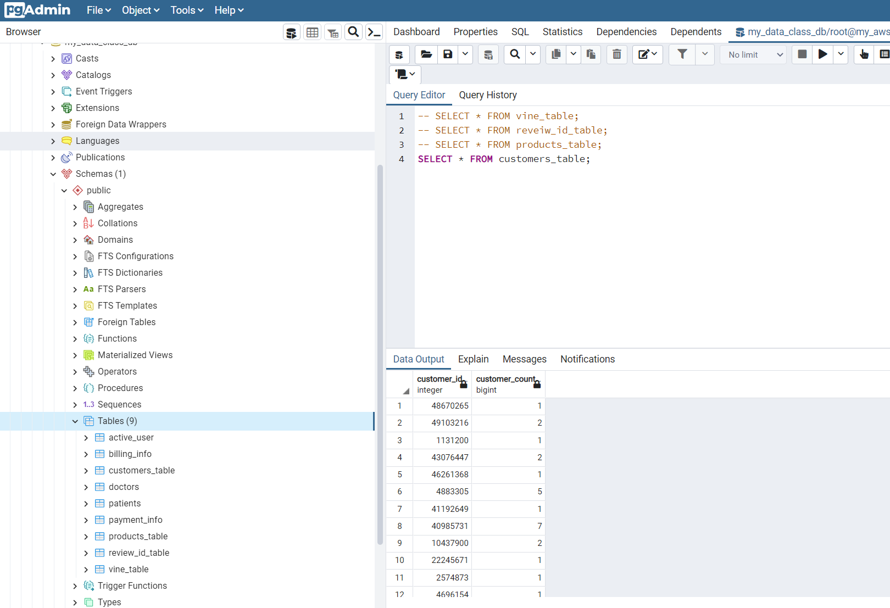
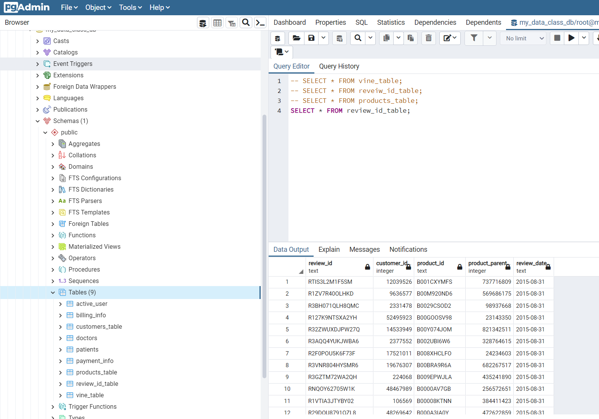
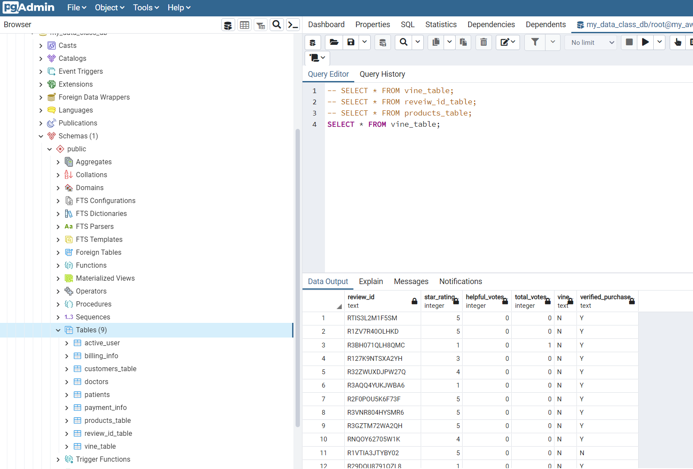
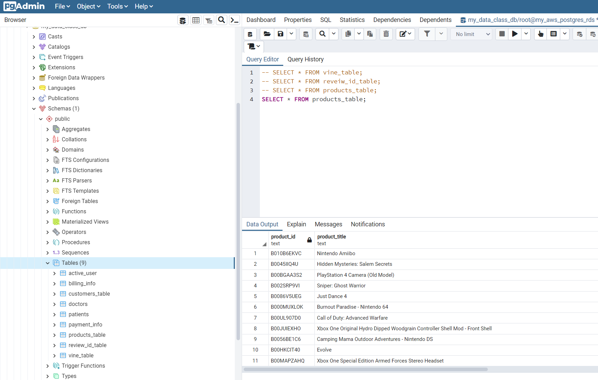
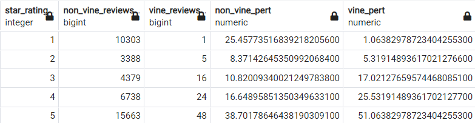

# Module 16 Big Data challenge Amazon Reviews

## Background

An analysis was conducted to determine if the proportion of positive reviews for Vine reviewers were different than those of the standard public. Vine reviewers are selected (and vetted) members chosen by Amazon to provide a review on products sent to them for free or discounted rates. In exchange, they provide an "in-depth" review of said product.

This analysis was conducted by collecting amazon reviews for video game titles via AWS's cloud Simple Storage Service (S3). The reviews were uploaded to an AWS database connection through Postgresql services. Once uploaded, the data was filtered and split into four distinct datasets for analysis. Of these four datasets, the "Vine_Table" containing all reviews and vine membership was drilled-down to determine a pattern among product ratings, vine versus non-vine reviews, and the level of helpfulness. Of these reviews, only those with more than 20 'helpful' upvotes and if the 'helpful' upvotes consisted of at least 50% of the total votes of each review were selected for analysis.

## Results
Four tables were created from the S3 Amazon Reviews dataset:

The total reviews based on the initial dataset prior to filtering down to the criteria for the 'helpful' upvotes consisted of:

* Vine Users: 4,291 reviews
* Non-Vine Users: 1,781,706 reviews

The total reviews after the criteria was applied consisted of:

* Vine Users: 94 reviews
* Non-Vine Users: 40,471 reviews

The proportion of reviews after the criteria was applied showed that 2.19% of Vine reviews remained, while  2.27% of non-Vine reviews remained. This reveals that the 'helpful' upvotes applied to each category of reviews is proportionally the same.

The "Star_Rating" is the rating assigned a product on a scale of 1-5. This is the value assigned by reviewers, Vine and non-Vine. When comparing percentage of reviews assigned to products overall, Vine reviewsers appear to review largely positive, with 51% of reviews being "5-Star", 25% being "4-Star", and 17% being "3-Star". Alternatively, non-Vine reviewers saw the top three ratings being 38% "5-Star", 25% "1-Star", and 16% "4-Star". The total reviews and the percentages can be seen in the image below.

## Conclusions

The Vine reviewers appear to be biased to give better reviews proportionally than average reviewers. This could be to the nature that Vine reviewers recieve products, as it provides incentive to continue to "promote" products rather than "review". Despite the "Star_Rating" analysis, it was surprising to see so few Vine and non-Vine reviews meeting the selection criteria. It was expected that Vine reviewers would see more 'helpful' review ratings with more total votes, yet the same was seen proportionally for both categories.

If a deeper analysis was to be conducted, it would be recommended that the proportion of Vine versus non-Vine average ratings be assessed for each product ID. This would determine if there was a bias per product, and if the product is popular/trending.